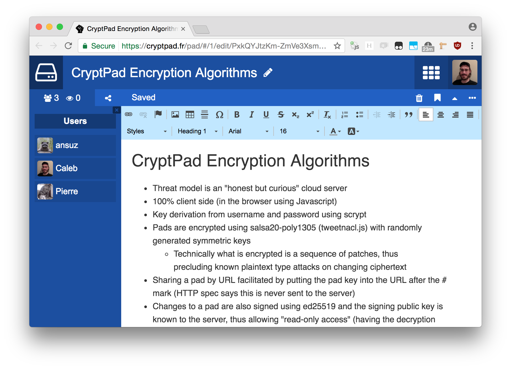
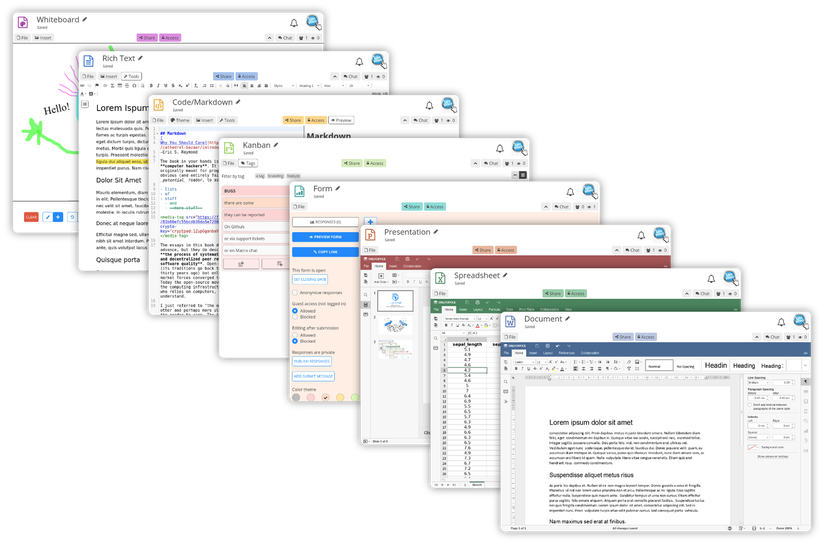

<!--
SPDX-FileCopyrightText: 2023 XWiki CryptPad Team <contact@cryptpad.org> and contributors

SPDX-License-Identifier: AGPL-3.0-or-later
-->

# CryptPad

CryptPad is a collaboration suite that is end-to-end-encrypted and open-source. It is built to enable collaboration, synchronizing changes to documents in real time. Because all data are encrypted, in the eventuality of a breach, attackers have no way of seeing the stored content. Moreover, if the administrators don’t alter the code, they and the service also cannot infer any piece of information about the users' content.

# Installation

## For development

Our [developer guide](https://docs.cryptpad.org/en/dev_guide/setup.html) provides instructions for setting up a local instance without HTTPS or our more advanced security features.

## For production

Configuring CryptPad for production requires a little more work, but the process is described in our [admin installation guide](https://docs.cryptpad.org/en/admin_guide/installation.html). From there you can find more information about customization and maintenance.

## Current version

The most recent version and all past release notes can be found on the [releases page on GitHub](https://github.com/cryptpad/cryptpad/releases/).

## Setup using Docker

You can find `Dockerfile`, `docker-compose.yml` and `docker-entrypoint.sh` files at the root of this repository. We also publish every release on [Docker Hub](https://hub.docker.com/r/cryptpad/cryptpad) as AMD64 & ARM64 official images.

Previously, Docker images were community maintained, had their own repository and weren't official supported. We changed that with v5.4.0 during July 2023. Thanks to @promasu for all the work on the community images.

# Privacy / Security

CryptPad offers a variety of collaborative tools that encrypt your data in your browser
before it is sent to the server and your collaborators. In the event that the server is
compromized, the database holds encrypted data that is not of much value to attackers.

The code which performs the encryption is still loaded from the host server like any
other web page, so you still need to trust the administrator to keep their server secure
and to send you the right code. An expert can download code from the server and check
that it isn't doing anything malicious like leaking your encryption keys, which is why
this is considered an [active attack].

The platform is designed to minimize what data is exposed to its operators. User
registration and account access are based on cryptographic keys that are derived from your
username and password. Hence, the server never needs to see either, and you don't need to
worry about whether they are being stored securely. It is impossible to verify whether a
server's operators are logging your IP or other activity, so if you consider this
information sensitive it is safest to assume it is being recorded and access your
preferred instance via [Tor browser].

A correctly configured instance has safeguards to prevent collaborators from doing some
nasty things like injecting scripts into collaborative documents or uploads. The project
is actively maintained and bugs that our safeguards don't catch tend to get fixed quickly.
For this reason it is best to only use instances that are running the most recent version,
which is currently on a three-month release cycle. It is difficult for a non-expert to
determine whether an instance is otherwise configured correctly, so we are actively
working on allowing administrators to opt in to a [public directory of
servers](https://cryptpad.org/instances/) that
meet our strict criteria for safety.

For end users, a [guide](https://blog.cryptpad.org/2024/03/14/Most-Secure-CryptPad-Usage/)
is provided in our blog to help understand the security of CryptPad. This blog post
also explains and show the best practices when using CryptPad and clarify what end-to-end
encryption entails and not.

# Translations

CryptPad can be translated with nothing more than a web browser via our
[Weblate instance](https://weblate.cryptpad.org/projects/cryptpad/app/). See the state of the translated languages:

More information about this can be found in [our translation guide](/customize.dist/translations/README.md).

# Contacting Us

The best places to reach the development team and the community are the [CryptPad Forum](https://forum.cryptpad.org) and the [Matrix chat](https://matrix.to/#/#cryptpad:matrix.xwiki.com)

The team is also on the fediverse: [@cryptpad@fosstodon.org](https://fosstodon.org/@cryptpad)

# Team

CryptPad is actively developed by a team at [XWiki SAS](https://www.xwiki.com), a company that has been building Open-Source software since 2004 with contributors from around the world. Between 2015 and 2019 it was funded by a research grant from the French state through [BPI France](https://www.bpifrance.fr/). In the years since we have been funded by [NLnet PET](https://nlnet.nl/PET/), [NGI TRUST](https://www.ngi.eu/ngi-projects/ngi-trust/), [NGI DAPSI](https://dapsi.ngi.eu/), subscribers of CryptPad.fr, and donations to our [Open-Collective campaign](https://opencollective.com/cryptpad).

# Contributing

We love Open Source and we love contribution. Learn more about [contributing](https://docs.cryptpad.org/en/how_to_contribute.html).

If you have any questions or comments, or if you're interested in contributing to CryptPad, come say hi in our [Matrix channel](https://app.element.io/#/room/#cryptpad:matrix.xwiki.com).

This project is tested with [BrowserStack](https://www.browserstack.com/).

# License

This software is and will always be available under the GNU Affero General Public License as
published by the Free Software Foundation, either version 3 of the License, or (at your option)
any later version. If you wish to use this technology in a proprietary product, please contact
sales@cryptpad.org

[Tor browser]: https://www.torproject.org/download/
[active attack]: https://en.wikipedia.org/wiki/Attack_(computing)#Types_of_attack

